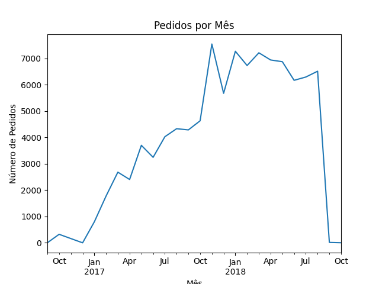
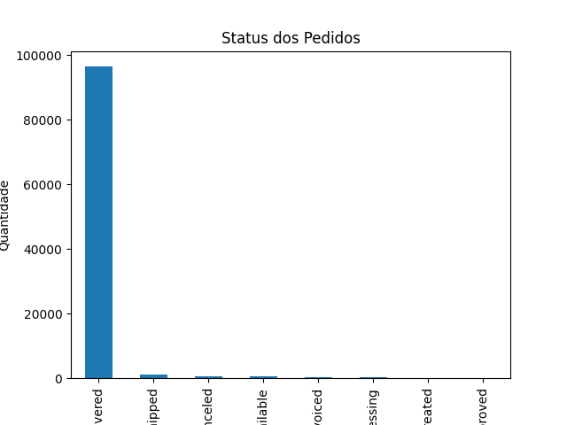
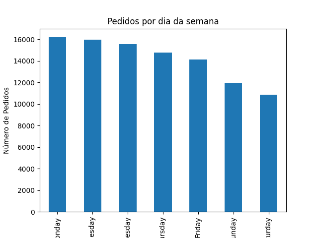
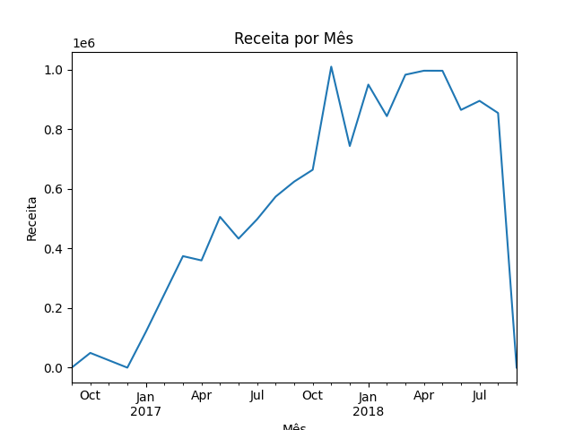

# Brazilian E-Commerce Data Analysis
This project is available in English and Portuguese (PT-BR).

## Dashboard
[View Power BI Dashboard] (https://drive.google.com/file/d/1-Kqdu2K0u0bYcV10CM0e09RXZyXptowS/view?usp=sharing)

## Key Business Questions
- How is e-commerce growing over time?
- When do customers buy the most?
- How efficient is the delivery process?
- How does revenue evolve over time?

## Project Overview
This project analyzes Brazilian e-commerce data using Python.

## Process
1. Data Cleaning (Python & Pandas)
2. Feature Engineering (month, weekday)
3. Exploratory Data Analysis
4. Dashboard Creation (Power BI)
5. Business Insights

## Dataset
The dataset used in this project is the Brazilian E-Commerce Public Dataset, which contains information about orders, customers, products, and payments.

## Tools
- Python
- Pandas
- Matplotlib

## Analyses
### Orders per month 
This chart shows the growth of Brazilian e-commerce orders over time.

### Order status 
This chart shows the distribution of orders by status, including delivered, cancelled, and delayed orders.

### Orders by weekday 
This chart shows on which days of the week orders are placed

### Revenue per month 
This chart shows revenue per month

## Insights
- Orders show consistent growth
- Most purchases happen during weekdays, especially on Monday, Tuesday and Wednesday
- The majority of orders are successfully delivered, indicating a reliable delivery process.

## Business Impact
- Helps understand sales growth trends
- Identifies customer purchasing behavior
- Evaluates delivery performance and efficiency
- Supports data-driven decision making

# PT-BR Analises de Dados E-Commerce Brasileiro 

## Visão Geral do Projeto
Este Projeto analisa dados de e-commerce brasileiro utilizando Python

## Principais perguntas de negócios
- Como o e-commerce está crescendo ao longo do tempo?
- Qual dia da semana os clientes compram mais?
- Quão eficiente é o processo de entrega?
- Como a receita evolui ao longo do tempo?

## Processos
1. Limpeza de Dados (Python e Pandas)
2. Engenharia de Recursos (mês, dia da semana)
3. Análise Exploratória de Dados
4. Criação de Dashboard (Power BI)
5. Insights de Negócios

## Datasets
O conjunto de dados utilizado neste projeto é Brazilian e-commerce public dataset, que contém informações sobre pedidos, clientes, produtos e pagamentos.

## Ferramentas
- Python
- Pandas
- Matplotlib

## Analises 
### Pedidos por mês
Este gráfico mostra o crescimento dos pedidos de e-commerce brasileiro ao longo do tempo

### Status dos Pedidos
Este gráfico mostra os pedidos que foram entregues, cancelados ou atrasados

### Pedidos por dia da semana
Este gráfico mostra em qual dia da semana ocorre a maioria dos pedidos

### Receita por mês
Este gráfico mostra a receita por mês

## Insights
- Os pedidos mostram um crescimento consistente.
- A maioria das compras ocorre durante os dias úteis, principalmente na segunda, terça e quarta-feira.
- A maioria dos pedidos foram entregues com sucesso, o que indica um processo de entrega confiável.

## Impacto nos negócios
- Ajuda a compreender as tendências de crescimento de vendas.
- Identifica padrões de comportamento de compra do cliente.
- Avalia o desempenho de entrega e a eficiência operacional.
- Apoia a tomada de decisões baseada em dados.
